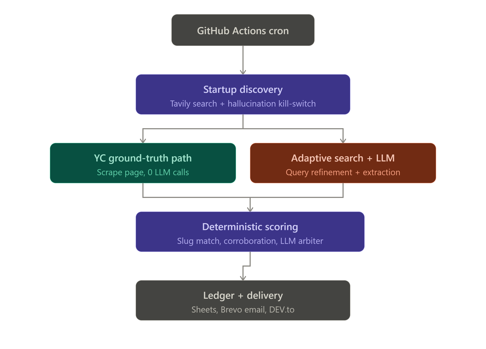

# 🚀 Founder Sourcing Pipeline

An autonomous OSINT pipeline that runs weekly on GitHub Actions, identifies startups that just raised a Pre-Seed, Seed, or Series A round from a tracked list of top VCs, and resolves their founders' verified LinkedIn/X profiles — ready for cold outreach or lead lists.

It is not a single autonomous "agent" loop. It's a deterministic pipeline with narrow, bounded LLM calls at specific decision points — each one scoped so the model can't hallucinate a fact that isn't independently checkable.

---

## Why this exists

Most "AI sourcing" scripts ask an LLM to output a list of names and links directly, then trust it. That's exactly how you get plausible-looking but fabricated LinkedIn URLs. This pipeline is built around the opposite principle: **the LLM never gets to be the final source of truth for a fact — it only gets to filter, propose, or break a tie between things that were independently retrieved.**

Every extracted fact has to survive a verification step that doesn't depend on the model's word alone:

- A startup is only accepted if the model returns a **verbatim quote** proving the funding round, and that quote is checked against the original source text.
- A founder's social profile is only accepted if it clears a **deterministic point score** built from URL-slug fuzzy matching, snippet corroboration, and cross-query overlap — the LLM is only invoked as a tie-breaker over a fixed, pre-scored menu of candidates it cannot deviate from.
- YC-backed startups skip the LLM path entirely: founders are scraped straight from YC's own server-rendered company page.

## Architecture



The pipeline runs as five stages, triggered weekly by a GitHub Actions cron job:

1. **Trigger** — GitHub Actions cron (`30 4 * * 1`, every Monday) or manual `workflow_dispatch`.
2. **Startup discovery** — Tavily search across a tracked list of VCs (Y Combinator, a16z, Sequoia, Founders Fund, South Park Commons, Lightspeed, First Round), scoped to a dynamic 270-day funding window. Results are passed through an LLM cascade (Groq `gpt-oss-120b` → `gpt-oss-20b` → `qwen3.6-27b`) that must return a verbatim evidence quote for every startup it extracts — quotes that don't match the source text are discarded as hallucinations, and known unicorns/mature companies are explicitly excluded.
3. **Founder resolution** — two paths depending on the source:
   - **YC ground-truth path** — for YC companies, the pipeline resolves the company slug against a daily-refreshed YC index and scrapes the "Active Founders" block directly from YC's own page. Zero LLM tokens, zero search credits, zero hallucination surface.
   - **Adaptive search + LLM path** — for everyone else, founder names are extracted from the already-fetched article text first (free), then via up to three widening search queries (VC abbreviations, stripped corporate suffixes, and finally an LLM-generated refined query) if that comes up empty.
4. **Deterministic scoring** — every candidate LinkedIn/X URL is scored on three independent signals: fuzzy match between the founder's name and the profile URL slug (`difflib.SequenceMatcher`), whether the startup's name appears in that specific search result's own snippet, and whether the URL was independently returned by two differently-phrased queries. Candidates ≥65 points are auto-accepted; candidates between 35–65 are handed to the LLM as a fixed, enumerated menu where it can only pick an index or reject — it cannot emit a new URL.
5. **State + delivery** — a cross-run ledger (`data/state/seen_startups.json`) is committed back to the repo so the same startup is never reported twice. Results sync to Google Sheets, get emailed via Brevo, and are auto-published as a markdown report to DEV.to.

## Tech stack

| Layer | Tool |
|---|---|
| Orchestration | GitHub Actions (cron + `workflow_dispatch`) |
| Search / retrieval | Tavily API |
| LLM inference | Groq (`openai/gpt-oss-120b`, `openai/gpt-oss-20b`, `qwen/qwen3.6-27b`), with automatic rate-limit and daily-quota cascading |
| Ground-truth scraping | Direct HTTP fetch of YC's server-rendered pages + the `yc-oss` community API mirror |
| State persistence | Git-committed JSON ledger |
| Delivery | Google Sheets (`gspread`), Brevo transactional email, DEV.to API |
| Language | Python 3.12 |

## Setup

### 1. Fork the repository

Click **Fork** in the top right corner to create your own copy.

### 2. Enable GitHub Actions

Forks have automations paused by default. Go to the **Actions** tab and click **"I understand my workflows, go ahead and enable them."**

### 3. Add repository secrets

Go to **Settings → Secrets and variables → Actions** and add:

| Secret | Required | Notes |
|---|:---:|---|
| `GROQ_API_KEY` | ✅ | Free tier from Groq's console |
| `TAVILY_API_KEY` | ✅ | Free tier from Tavily's console |
| `SENDER_EMAIL` | ✅ | The address Brevo sends the report from |
| `SPREADSHEET_ID` | ✅ | Google Sheet used for subscriber list + report cache |
| `BREVO_API_KEY` | ✅ | Powers report email delivery |
| `GCP_SA_KEY` | ✅ | Google service-account JSON key (for Sheets access) |
| `RECEIVER_EMAIL` | Optional | Fallback recipient if the Sheet has no subscribers |
| `DEV_TO_API_KEY` | Optional | Enables auto-publishing the weekly report to DEV.to |
| `DEV_TO_ORG_ID` | Optional | Publish under an organization instead of your personal account |
| `YC_OSS_URL` | Optional | Override for the YC directory mirror endpoint |

### 4. Run it

Go to the **Actions** tab → **Weekly Founder Sourcing Pipeline** → **Run workflow**. After that it runs automatically every Monday at 04:30 UTC.

### Running locally

```bash
git clone https://github.com/<your-username>/founder-sourcing-pipeline.git
cd founder-sourcing-pipeline
cp .env.sample .env   # fill in your keys
pip install groq tavily-python gspread requests python-dotenv
python script.py
```

You'll also need a `credentials.json` Google service-account key in the project root for Sheets access.

## Repo structure

```
.
├── .github/workflows/tracker.yml   # cron schedule + CI job
├── data/state/seen_startups.json   # cross-run dedupe ledger (git-committed)
├── script.py                       # the entire pipeline
├── .env.sample                     # required environment variables
└── sourcing_report.json            # latest run's output (generated)
```

## Notes

- `MAX_NEW_STARTUPS_PER_RUN` is capped at 10 by default to keep each run inside free-tier API limits — adjust in `script.py` if you have higher quotas.
- The model cascade automatically detects 429s vs. daily quota exhaustion vs. oversized payloads and reacts differently to each (short backoff, model blacklist for the run, or immediate cascade), rather than treating every failure the same way.
- This is a personal research/lead-gen tool, not a product — it plays nicely with API rate limits and doesn't hit any endpoint aggressively.
